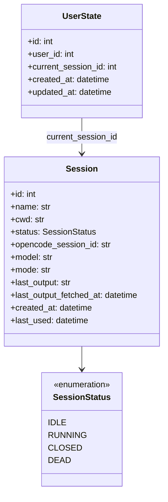
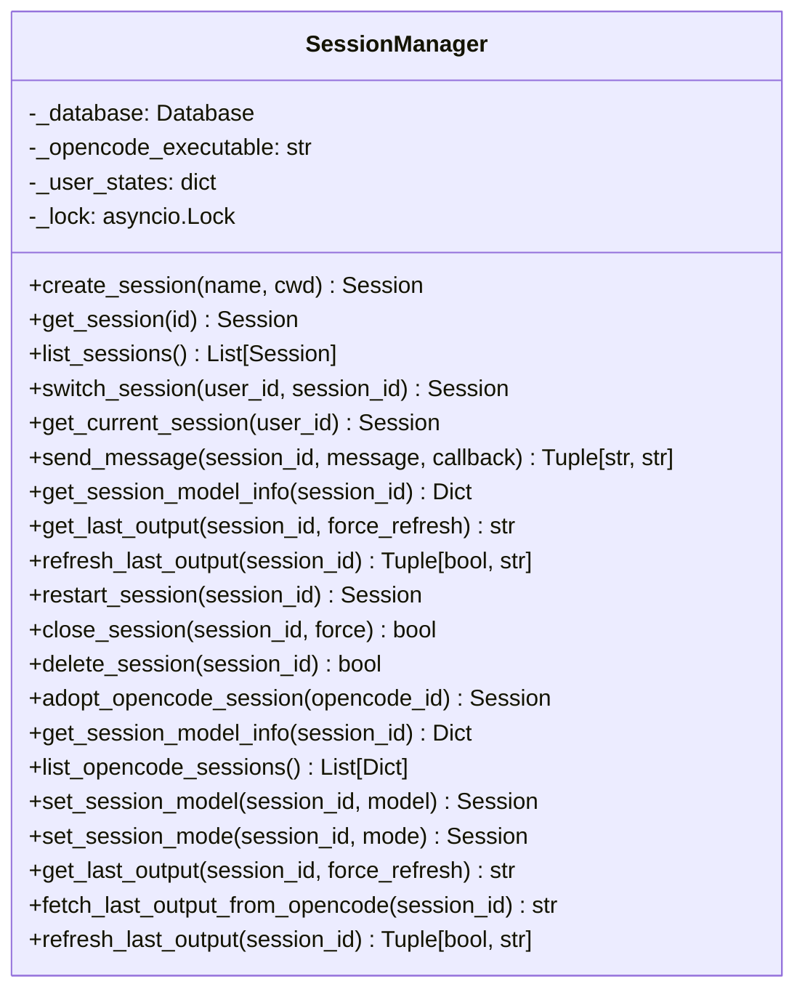
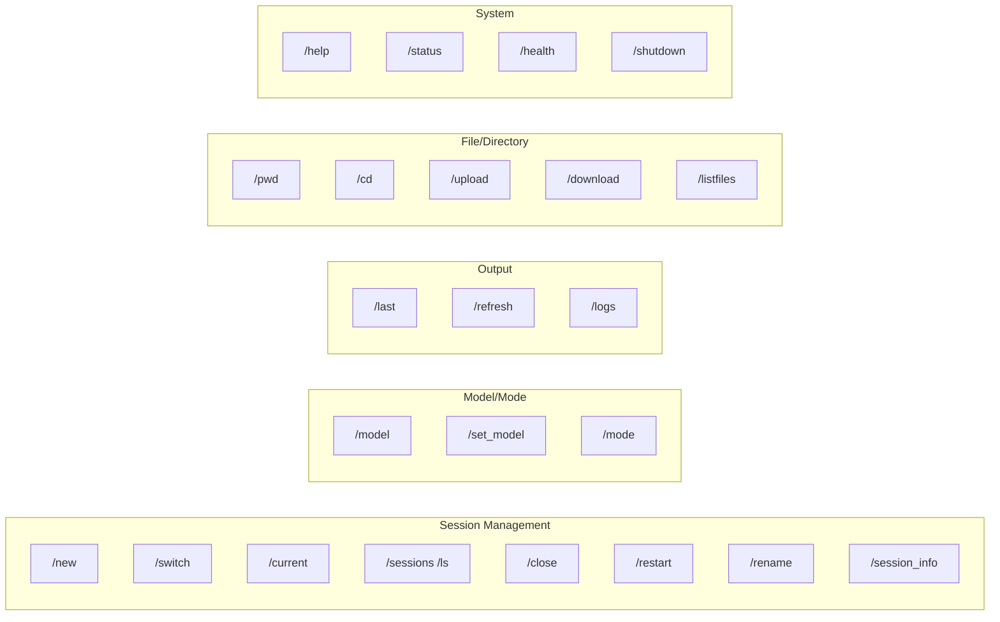
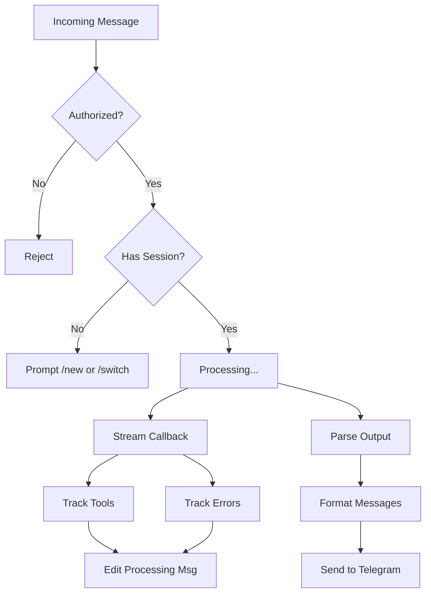
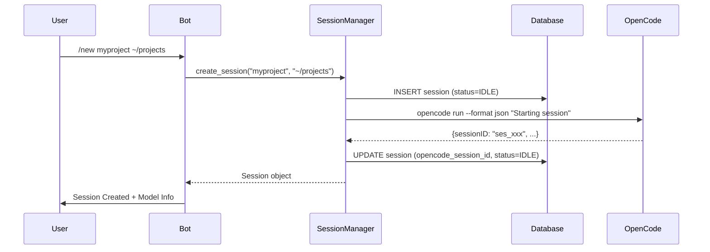
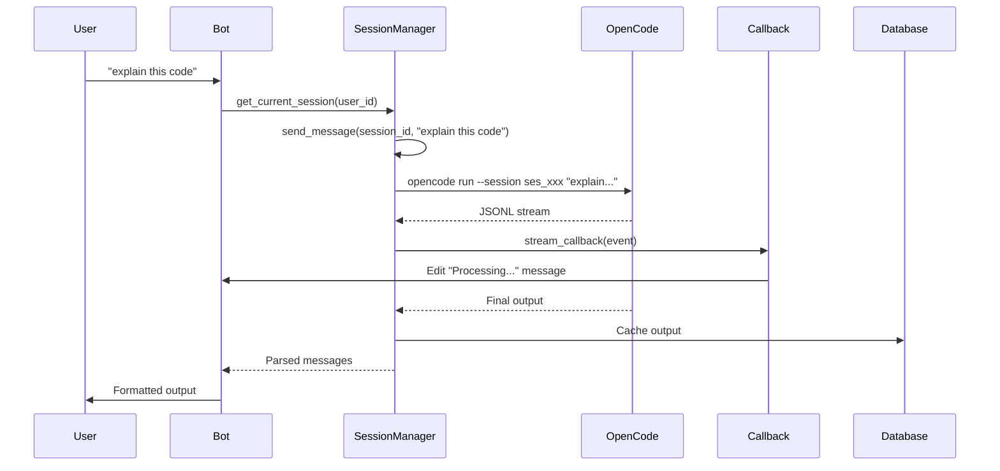
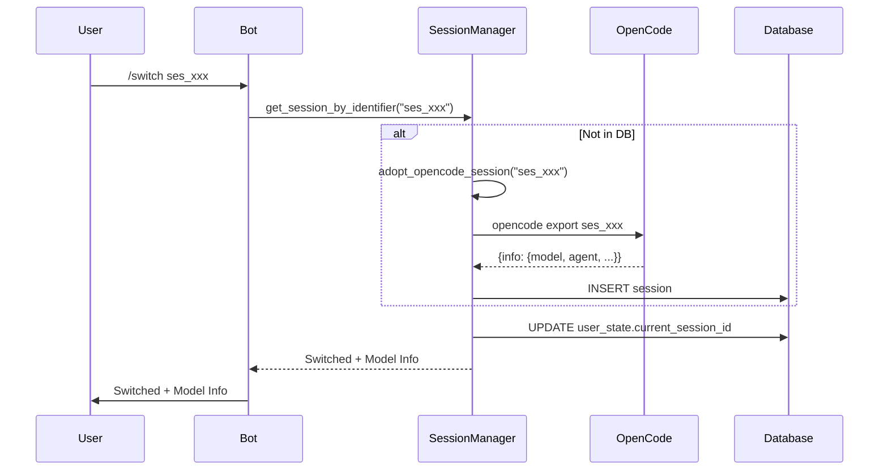

# Telebot Architecture Diagram

## System Overview

Telebot is a Telegram bot that acts as a terminal multiplexer for OpenCode sessions. It allows users to create, manage, and interact with persistent OpenCode sessions entirely from Telegram.

---

## High-Level Architecture

```mermaid
graph TB
    subgraph "Telegram"
        User[Users]
        TG[Telegram Servers]
        BotAPI[Bot API]
    end

    subgraph "Telebot Application"
        Main[main.py - Entry Point]
        App[Application Builder]
        Handlers[Command/Message Handlers]
        SessionMgr[SessionManager]
        Database[(SQLite Database)]
    end

    subgraph "External Systems"
        OpenCode[OpenCode CLI]
        FileSystem[File System]
    end

    User -->|Messages| TG
    TG -->|Exposes| BotAPI
    BotAPI <-->|Long Polling (getUpdates)| Main
    BotAPI -.->|HTTPS Webhook POST| Main
    Main --> App
    App --> Handlers
    Handlers --> SessionMgr
    SessionMgr --> Database
    SessionMgr --> OpenCode
    SessionMgr --> FileSystem
    Handlers --> Database
```

---

## Component Architecture

### 1. **Entry Point Layer** (`app/bot/main.py`)
- **Purpose**: Application bootstrap, webhook/polling setup
- **Key Components**:
  - `create_application()` - Builds Telegram Application with all handlers
  - `post_init()` - Initializes SessionManager, restores sessions
  - `post_shutdown()` - Cleanup on shutdown
  - `run_webhook()` / `run_polling()` - Webhook vs polling modes
  - **Polling Mode**: `application.run_polling()` - Long-polls Telegram's `getUpdates` endpoint
  - **Webhook Mode**: `run_webhook()` - Starts aiohttp server for Telegram to POST updates
  - Health check endpoint (`/health`)

### 2. **Configuration Layer** (`app/config.py`)
- **Settings Class**: Pydantic BaseSettings with environment variable support
- **Key Settings**:
  - `telegram_bot_token` - Bot token from Bot token from BotFather
  - `opencode_executable` - Path to opencode binary
  - `database_url` - SQLite connection string
  - `allowed_user_ids_str` - Comma-separated authorized user IDs
  - Webhook settings (URL, port, path, secret)
  - Session/streaming timeouts and limits

### 3. **Data Layer** (`app/models.py`, `app/database.py`)

#### Models (`app/models.py`)


#### Database Layer (`app/database.py`)
- **Database Class**: Async SQLModel wrapper with SQLite
  - Async engine with connection pooling
  - Session factory with `expire_on_commit=False`
  - `init_db()` - Creates tables
  - Context manager for sessions with auto commit/rollback
  
- **SessionRepository**: CRUD operations for sessions
  - `create()`, `get()`, `get_by_name()`, `list()`, `update()`, `delete()`
  
- **UserStateRepository**: Per-user session state
  - `get_current_session(user_id)` / `set_current_session(user_id, session_id)`

### 4. **Service Layer** (`app/services/`)

#### SessionManager (`app/services/session_manager.py`)
**Core service managing OpenCode sessions**



**Key Responsibilities**:
- **Session Lifecycle**: Create, switch, restart, close, delete
- **OpenCode Integration**: Run `opencode run --format json` as subprocess
- **Streaming Support**: Callback-based incremental updates
- **Model/Mode Management**: Persist and apply model/mode per session
- **Output Caching**: Hybrid cache with auto-refresh (10 min TTL)
- **External Session Adoption**: Import existing OpenCode sessions
- **OpenCode Session Discovery**: List sessions via `opencode session list`

#### OpenCodeSession (`app/services/opencode_session.py`)
**Legacy persistent process manager** (not currently used - kept for reference)

### 5. **Handler Layer** (`app/bot/handlers/`)

#### Command Handlers (`app/bot/handlers/commands.py`)


**Key Features**:
- All commands check user authorization
- Model info displayed after `/new` and `/switch`
- Streaming output with incremental updates
- Smart output chunking (4000 char limit)
- HTML formatting with emojis

#### Message Handler (`app/bot/handlers/messages.py`)


**Key Features**:
- Streaming callback for real-time tool updates
- Incremental processing message updates
- JSONL output parsing with state machine
- Smart text chunking (preserves code blocks)
- HTML formatting with fallback
- Tool completion notifications

#### Message Parsing (`parse_opencode_output`)
- Parses JSONL (newline-delimited JSON) from OpenCode
- Extracts: text, tool calls, errors, step events
- Tracks tool state (running/completed/failed)
- Formats for Telegram with emojis and HTML

---

## Data Flow

### Session Creation Flow


### Message Sending Flow


### Session Switch Flow


---

## External Integration: OpenCode

### Commands Used
| Command | Purpose | Format |
|---------|---------|--------|
| `opencode run --format json` | Run message in session | JSONL streaming |
| `opencode export <id>` | Get session info/history | JSON |
| `opencode session list --format json` | List all sessions | JSON array |
| `opencode models` | List available models | Plain text |

### OpenCode JSONL Event Types
| Type | Description |
|------|-------------|
| `text` | Assistant text response (in `part.text`) |
| `tool` / `tool_use` | Tool invocation with input/state |
| `step_start` | Step beginning (thinking) |
| `step_finish` | Step completion |
| `error` | Error message |

---

## Security

- **Authorization**: Per-user allowed list via `allowed_user_ids`
- **Input Validation**: Pydantic models for all inputs
- **SQL Injection Prevention**: SQLModel ORM (parameterized queries)
- **Path Traversal**: `Path.resolve()` for directory operations
- **Command Injection**: `asyncio.create_subprocess_exec` (no shell)

---

## Deployment

### Modes
1. **Polling** (default): `application.run_polling()`
   - Long-polling via Telegram `getUpdates` API
   - Bot initiates HTTPS requests to Telegram `getUpdates` endpoint
   - Telegram responds with pending updates
   - No public HTTPS endpoint required
   - Simpler deployment (no reverse proxy/certs needed)
   - Default mode when `WEBHOOK_MODE=false`

2. **Webhook**: `run_webhook()` with aiohttp server
   - Telegram pushes updates via HTTPS POST to your endpoint
   - Requires public HTTPS URL with valid certificate
   - Lower latency (push vs pull)
   - Requires reverse proxy (nginx) + SSL certs
   - Enabled when `WEBHOOK_MODE=true` + `WEBHOOK_URL` set

### Docker
- `Dockerfile` - Multi-stage build
- `docker-compose.yml` - Service orchestration
- SQLite persistence via volume

---

## Key Design Patterns

1. **Repository Pattern**: Database abstraction
2. **Callback Pattern**: Streaming updates from OpenCode
3. **Hybrid Caching**: Memory + DB with TTL
4. **Graceful Degradation**: HTML fallback for formatting
5. **Graceful Session Adoption**: Import external OpenCode sessions
6. **Auto-refresh**: Stale cache auto-refresh (10 min)

---

## Technology Stack

| Layer | Technology |
|-------|------------|
| Language | Python 3.12+ |
| Async Framework | asyncio |
| Telegram Library | python-telegram-bot v21+ |
| Database | SQLite + SQLModel (SQLAlchemy) |
| Config | Pydantic Settings |
| Logging | Rich + Structured Logging |
| Testing | pytest + pytest-asyncio |
| Linting | Ruff |
| Type Checking | mypy |
| Formatting | Black |

---

## File Structure Summary

```
telebot/
├── app/
│   ├── __init__.py
│   ├── config.py              # Configuration
│   ├── models.py              # Data models
│   ├── database.py            # Database layer
│   ├── logging.py             # Logging setup
│   ├── bot/
│   │   ├── main.py            # Entry point
│   │   └── handlers/
│   │       ├── commands.py    # 30+ command handlers
│   │       └── messages.py    # Message/document handling
│   └── services/
│       ├── session_manager.py # Core business logic
│       └── opencode_session.py
├── tests/
├── Makefile
├── pyproject.toml
├── Dockerfile
├── docker-compose.yml
├── .env
└── telebot.db
```

---

## Critical Flows Summary

| Operation | Components Involved |
|-----------|---------------------|
| Create Session | Bot → SessionManager → Database + OpenCode |
| Send Message | Bot → SessionManager → OpenCode (streaming) → Callback → Bot |
| Switch Session | Bot → SessionManager → Database + (OpenCode adopt) |
| Get Model Info | Bot → SessionManager → OpenCode export |
| Refresh Output | Bot → SessionManager → OpenCode export → Cache |
| List Sessions | Bot → SessionManager → Database + OpenCode CLI |
| File Upload | Bot → SessionManager → FileSystem |
| Set Model/Mode | Bot → SessionManager → Database (persisted for future runs) |

---

## Extensibility Points

1. **New Commands**: Add handler in `commands.py`, register in `main.py`
2. **New Output Formats**: Extend `parse_opencode_output()` and `send_formatted_message()`
3. **New OpenCode Features**: Add methods to `SessionManager`
4. **Different Databases**: Swap `Database` class (SQLModel supports PostgreSQL, MySQL)
5. **Auth Providers**: Extend `is_user_allowed()` in `SessionManager`